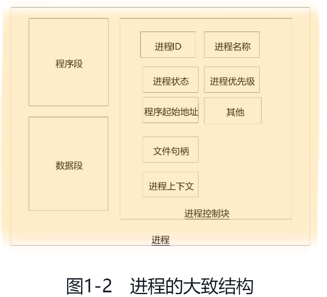

## 进程和线程
### 进程的基本原理
一般来说，进程由程序段、数据段和进程控制块三部分组成。进程的大致结构如下图所示

1. 程序段是进程的程序指令在内存中的位置，包含需要执行的指令集合
2. 数据段是进程的操作数据在内存中的位置，包含需要操作的数据集合
3. 程序控制块(pcb)包含进程的描述信息和控制信息，是进程存在的唯一标志。
    PCB主要由四大部分组成：
    
    1. 进程的描述信息。主要包括：进程ID和进程名称，进程ID是唯一的，代表进程的身份；进程状态，比如运行、阻塞、就绪；进程优先级，是进程调度的重要依据 
    2. 进程的调度信息。 主要包括：程序起始地址，程序的第一行指令的内存地址，从这里开始程序的执行；通信信息，进程间通信间的消息队列
   3. 进程的资源信息。 主要包括：内存信息，内存占用情况和内存管理所用的数据结构；IO设备信息，所用的IO设备编号及相应的数据结构；文件句柄，所打开的文件的信息。
   4. 进程上下文。主要包含执行时各种CPU寄存器的值、当前程序计数器（PC)的值以及各种栈的值等，即进程的环境。在操作系统切换进程时，当前进程被迫让出CPU，当前进程的上下文就保存在PCB中，供下次恢复运行时使用。
### 线程的基本原理
每当使用Java命令执行一个class类时，实际上就是启动了一个JVM进程。理论上，在该进程的内部至少会启动两个线程，一个是main线程，另一个是GC（垃圾回收）线程。实际上，执行一个Java程序后，通过Process Explorer来观察，线程数量远远不止两个，达到了18个之多。

一个标准的线程主要由三部分组成，即线程描述信息、程序计数器和栈内存。

1. 线程描述信息
   1. 线程ID，唯一标识符
   2. 线程名称。用户可以指定，如果没有默认分配
   3. 线程优先级
   4. 线程状态
   5. 其他，例如是否为守护线程
```
        Print.cfo("当前线程名称：" + Thread.currentThread().getName());
        Print.cfo("当前线程ID：" + Thread.currentThread().getId());
        Print.cfo("当前线程状态：" + Thread.currentThread().getState());
        Print.cfo("当前线程优先级：" + Thread.currentThread().getPriority());****
```
2. 程序计数器。记录这下一条指令的代码段内存地址

3. 栈内存。栈空间是代码中局部变量的存储空间，为线程所独有，在线程之间不共享，不受gc管理。
